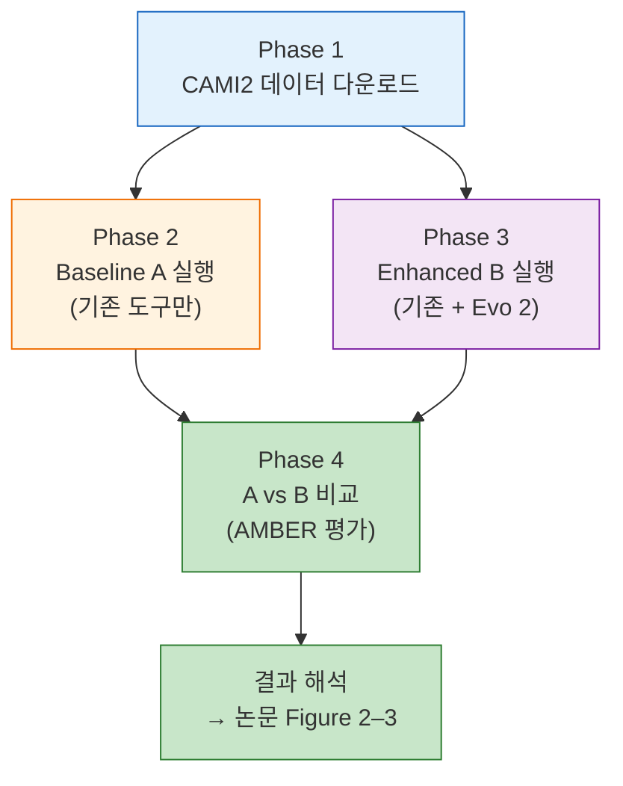

---
tags:
  - experiment
  - Evo2
  - MAG
  - CAMI2
  - 벤치마크
  - 비닝
  - 드라이랩
created: 2026-03-14
status: planning
related-project: "[[03_Projects/Evo2-mmlong2-MAG-enhancement]]"
---

# Step 1. CAMI2 벤치마크 — Evo 2 × mmlong2 방법론 검증

> [!abstract] 한 줄 요약
> 정답이 있는 CAMI2 데이터에 기존 도구(Baseline A)와 Evo 2를 추가한 방법(Enhanced B)을 각각 돌려서, **숫자로 얼마나 좋아지는지** 증명한다.

---

## 전체 흐름 한눈에 보기



---

## 사전 준비

### 하드웨어

| 항목   | 최소 요구                 | 권장                     |
| ---- | --------------------- | ---------------------- |
| GPU  | H100 SXM × 1 (7B 모델) | 대형 GPU × 4+ (40B 모델) |
| RAM  | 64 GB                 | 128 GB+                |
| 스토리지 | 500 GB (데이터+모델)       | 1 TB+                  |
| CPU  | 16코어                  | 32코어+                  |

### 컴퓨팅 환경 옵션

#### 옵션 A: RunPod (클라우드 GPU) ⭐ 추천

비싼 GPU를 시간 단위로 빌려쓰는 서비스. 연구실에 A100이 없어도 바로 시작 가능.

| 항목 | 내용 |
|------|------|
| 사이트 | [runpod.io](https://runpod.io) |
| 추천 인스턴스 (7B) | **1× A100 80GB** — Community Cloud ~$1.5/hr |
| 추천 인스턴스 (40B) | **4× A100 80GB** — Community Cloud ~$6/hr |
| 스토리지 | Network Volume 200GB+ 생성 (모델+데이터 보관, 인스턴스 꺼도 유지) |
| OS 템플릿 | `RunPod PyTorch 2.1` 또는 `RunPod CUDA 12.1` |

**RunPod 셋업 순서:**

```bash
# 1. runpod.io 가입 → 크레딧 충전 ($50~100이면 7B 기준 수십 시간)

# 2. Network Volume 생성 (Secure Cloud → Volumes → Create)
#    - 이름: evo2-mag-data
#    - 용량: 200 GB
#    - 리전: 가용 GPU가 있는 곳으로 선택

# 3. GPU Pod 생성 (Pods → Deploy)
#    - Template: RunPod PyTorch 2.1
#    - GPU: 1× A100 80GB SXM (7B용) 또는 4× A100 80GB (40B용)
#    - Volume: evo2-mag-data 마운트 (/workspace/data)
#    - Container Disk: 50 GB

# 4. Pod 시작 후 터미널 접속 (Connect → Start Terminal)

# 5. 데이터와 모델을 Network Volume에 저장하면
#    Pod을 끄고 다시 켜도 데이터 유지됨
```

> [!tip] RunPod 비용 절약 팁
> - **Community Cloud**가 Secure Cloud보다 ~50% 저렴
> - **Spot 인스턴스** 활용 시 추가 할인 (단, 갑자기 중단될 수 있음 → 체크포인트 저장 중요)
> - 안 쓸 때 **반드시 Pod Stop** — 돌아가는 동안 계속 과금
> - 데이터는 Network Volume에 보관 → Pod 꺼도 비용 $0.07/GB/월만 발생
> - 어셈블리/비닝(CPU 작업)은 연구실 서버에서 하고, **Evo 2 추론만 RunPod**에서 돌리면 GPU 비용 최소화

> [!warning] RunPod에서 대용량 데이터 전송
> ```bash
> # CAMI2 데이터를 직접 다운로드 (Pod 내에서)
> wget https://data.cami-challenge.org/camiClient.jar
> java -jar camiClient.jar -d ... -o /workspace/data/cami2/
>
> # 또는 연구실 서버에서 rsync
> rsync -avz ./cami2_data/ root@{POD_IP}:/workspace/data/cami2/
> ```

#### 옵션 B: 연구실 서버 (CPU 전용, GPU 없음)

> [!info] 연구실 서버에는 GPU가 없다
> GPU 작업은 전부 RunPod에서 수행. 연구실 서버는 CPU 작업(어셈블리, 비닝, 주석, 평가) 전담.

| 항목 | 확인 사항 |
|------|----------|
| 가용 스토리지 | `df -h` → 500GB 이상 여유 확인 |
| RAM | `free -h` → 64GB 이상 권장 (metaFlye 어셈블리에 메모리 많이 소모) |
| CPU 코어 | `nproc` → 16코어 이상 권장 |
| Conda 설치 | `conda --version` → 없으면 Miniconda 설치 |

#### 옵션 C: Mac mini M4 — 컨트롤 타워 🖥️

내 Mac mini에서 **직접 분석을 돌리지 않는다**. 대신 SSH로 연구실 서버와 RunPod에 접속해서 **원격 제어**하는 관제탑 역할.

| 항목   | 스펙       |
| ---- | -------- |
| 칩    | Apple M4 |
| RAM  | 24 GB    |
| 스토리지 | 512 GB   |

**컨트롤 타워로서의 역할:**
- `ssh`로 연구실 서버 접속 → Phase 1, 2, 4 명령 실행
- `ssh`로 RunPod 접속 → Phase 3 (Evo 2) 명령 실행
- 코드 작성, 스크립트 개발 (VS Code Remote-SSH 추천)
- 결과 파일 다운로드 후 시각화, 논문 작성
- `rsync`로 서버 ↔ RunPod 간 데이터 중계 (필요시)

**Mac mini 셋업:**

```bash
# 1. iTerm2 설치 (기본 터미널보다 편함 — 분할 화면, 탭, 검색 등)
#    https://iterm2.com 에서 다운로드 → Applications에 드래그
#    또는 Homebrew로:
brew install --cask iterm2

# 2. SSH 접속
ssh user@연구실서버IP              # 연구실 서버
ssh root@RunPod_IP -p PORT -i ~/.ssh/id_rsa  # RunPod

# 3. VS Code Remote-SSH (코드 편집용, 추천)
#    VS Code → Extensions → "Remote - SSH" 설치
#    Cmd+Shift+P → "Remote-SSH: Connect to Host"
#    서버 주소 입력 → 원격 터미널에서 바로 작업
```

> [!tip] rsync란?
> **r**emote **sync** — 컴퓨터 간 파일 동기화 도구. 바뀐 부분만 전송해서 빠르다.
> macOS에 **기본 설치**되어 있으므로 따로 설치 불필요.
> ```bash
> # 사용법: rsync -avz [보낼 파일] [받는 곳]
> rsync -avz ./data/ user@server:/path/to/dest/  # Mac → 서버
> rsync -avz user@server:/path/to/results/ ./local_results/  # 서버 → Mac
> ```

#### 역할 분담: RunPod(GPU) + 연구실 서버(CPU)

| 작업 | 어디서? | 이유 |
|------|--------|------|
| Phase 1 (데이터 다운로드) | 연구실 서버 | 네트워크 빠르고, 저장 공간 넉넉 |
| Phase 2 (mmlong2 전체) | 연구실 서버 | CPU 작업 — **한 줄 명령으로 자동** |
| Phase 3 (Evo 2 추론 전체) | **RunPod** | ⚡ GPU 필수 |
| Phase 4 (AMBER 평가) | 연구실 서버 | CPU만으로 충분 |

#### 데이터 이동 워크플로우

```
연구실 서버                          RunPod (GPU)
───────────                      ──────────────
Phase 1: 데이터 다운로드
Phase 2: mmlong2 실행 (한 줄)
    │
    ├── results/baseline/results/assembly.fasta
    ├── results/baseline/results/bins/ (MAG 세트)
    ├── results/baseline/results/bakta/ (주석 결과)
    │
    └──── rsync로 전송 ──────────→  Phase 3: Evo 2 추론
                                      │
                                      ├── contig_embeddings.npz
                                      ├── evo2_c2b.tsv
                                      ├── perplexity 결과
                                      │
    ←──── rsync로 회수 ─────────── └── 결과 파일들

Phase 4: AMBER 평가
```

```bash
# 연구실 → RunPod 전송 (Phase 2 mmlong2 완료 후)
rsync -avz --progress \
    ./results/baseline/results/assembly.fasta \
    ./results/baseline/results/bins/ \
    ./results/baseline/results/bakta/ \
    root@{RUNPOD_IP}:/workspace/data/from_server/

# RunPod → 연구실 회수 (Phase 3 완료 후)
rsync -avz --progress \
    root@{RUNPOD_IP}:/workspace/data/evo2_results/ \
    ./results/evo2/
```

> [!tip] RunPod IP 확인
> RunPod 대시보드 → Pod → Connect → SSH 정보에서 IP와 포트 확인
> ```bash
> ssh root@{IP} -p {PORT} -i ~/.ssh/id_rsa
> ```

> [!success] 이 전략의 핵심
> RunPod GPU 사용 시간을 **Phase 3만** (~8–18시간)으로 한정.
> 7B 기준 예상 비용: $1.5/hr × 18hr = **~$27** (약 3.5만원)
> 나머지는 전부 연구실 서버(무료)에서 처리.

### 소프트웨어 설치 목록

```bash
# 1. Conda 환경 생성
conda create -n evo2-mag python=3.10
conda activate evo2-mag

# 2. mmlong2 (Singularity 컨테이너 기반 — 내부 도구 자동 포함)
#    GitHub: https://github.com/Serka-M/mmlong2
#    설치 방법은 README 참조. Singularity 필요.
mamba install -c conda-forge singularity
# mmlong2 자체는 GitHub에서 clone하거나 conda로 설치

# 3. 평가 도구 (mmlong2에 포함 안 됨)
pip install cami-amber

# 4. Evo 2 (RunPod에서 설치)
pip install evo2
```

> [!info] mmlong2가 알아서 설치해주는 것들
> mmlong2는 Singularity 컨테이너에 metaFlye, Medaka, MetaBAT2, SemiBin2, GraphMB, DAS Tool, CheckM2, Bakta를 **전부 포함**하고 있다. 개별 설치 불필요.

---

## Phase 1. CAMI2 데이터 확보

### CAMI2가 뭔가?

인공적으로 만든 **메타게놈 시험 데이터**. 어떤 미생물이 얼마나 들어있는지 **정답(ground truth)을 알고 있어서, 도구의 정확도를 채점할 수 있다.

| 항목 | 내용 |
|------|------|
| 게놈 수 | 224개 (세균 중심 + 진균 + 식물) |
| Long-read | Nanopore 5 Gb + PacBio 5 Gb |
| Short-read | 5 Gb paired-end |
| 조성 | ~90% 세균, ~9% 진균, ~1% 식물 |
| Ground truth | 게놈 서열, 풍부도, 분류 정보 모두 제공 |

### 다운로드

```bash
# CAMI2 다운로드 도구
wget https://data.cami-challenge.org/camiClient.jar

# Rhizosphere 데이터셋 (long-read 포함) 다운로드
java -jar camiClient.jar -d https://data.cami-challenge.org/cami2 \
     -t rhizosphere \
     -o ./cami2_data/
```

> [!info] 데이터셋 선택
> CAMI2에는 여러 데이터셋이 있다:
> - **Rhizosphere** — 토양 근권 환경, mmlong2의 MFD-LR(토양)과 가장 유사 ← **이것 추천**
> - Marine — 해양 환경
> - Strain-madness — 고변이 데이터 (난이도 높음)

### 다운로드 후 확인

```bash
# 파일 구조 확인
ls ./cami2_data/
# → reads_nanopore.fq.gz, reads_pacbio.fq.gz, reads_short_1.fq.gz, reads_short_2.fq.gz
# → ground_truth/ (게놈 서열, 풍부도, 비닝 정답)

# 데이터 크기 확인
du -sh ./cami2_data/*
```

- [ ] CAMI2 Rhizosphere 데이터셋 다운로드 완료
- [ ] Ground truth 파일 확인 (genome_to_id.tsv, abundance.tsv)
- [ ] Nanopore read 파일 확인 (reads_nanopore.fq.gz)

---

## Phase 2. Baseline A — mmlong2로 한 번에 실행

> [!important] 이 단계의 목적
> Evo 2 **없이** mmlong2 파이프라인을 돌린다. 이 결과가 **비교 기준(baseline)**이 된다.

### mmlong2 = 어셈블리 → 폴리싱 → 비닝 → 품질 평가를 한 줄로

mmlong2는 아래 단계를 **자동으로** 순서대로 실행한다:
1. metaFlye 어셈블리
2. Medaka 폴리싱
3. Tiara 진핵 contig 제거
4. 앙상블 비닝 (MetaBAT2 + SemiBin2 + GraphMB → DAS Tool)
5. 반복 비닝 (미분류 contig 재시도 × 3회)
6. CheckM2 품질 평가
7. Bakta 기능 주석

```bash
# mmlong2 설치 (Singularity 필요)
# 서버에 Singularity가 없으면: conda install -c conda-forge singularity

# ⭐ Phase 2 실행 — 이 한 줄이면 끝
mmlong2 -np ./cami2_data/reads_nanopore.fq.gz \
        -o ./results/baseline \
        -p 16
```

| 파라미터 | 설명 |
|---------|------|
| `-np` | Nanopore read 입력 (PacBio면 `-pb`) |
| `-o` | 출력 디렉토리 |
| `-p 16` | 사용할 CPU 프로세스 수 |

> [!tip] 어셈블러 선택 옵션
> mmlong2는 기본으로 metaFlye를 사용하지만 다른 어셈블러도 선택 가능:
> - `-fly` — metaFlye (기본값, 추천)
> - `-dbg` — metaMDBG
> - `-myl` — myloasm

### mmlong2 출력 구조

```
./results/baseline/
├── results/
│   ├── bins/              ← ⭐ Baseline MAG 세트 (.fa 파일들)
│   ├── bakta/             ← 기능 주석 결과
│   ├── 16S.fa             ← 16S rRNA 서열
│   ├── bins.tsv           ← 각 bin 정보 (completeness, contamination 등)
│   ├── contigs.tsv        ← contig별 정보
│   └── general.tsv        ← 전체 통계
```

> [!info] mmlong2는 Bakta를 사용한다
> mmlong2는 기능 주석에 Prokka 대신 **Bakta**를 사용. Bakta가 더 최신이고 정확하며, hypothetical protein 비율도 여기서 확인 가능.

### Baseline A 결과 확인

```bash
# MAG 수 확인
ls ./results/baseline/results/bins/*.fa | wc -l

# 품질 통계 확인 (completeness, contamination)
cat ./results/baseline/results/bins.tsv

# hypothetical protein 비율 확인 (Bakta 결과에서)
for gff in ./results/baseline/results/bakta/*/*.gff3; do
    name=$(basename $(dirname $gff))
    total=$(grep -c "CDS" $gff)
    hypo=$(grep -c "hypothetical protein" $gff)
    echo "$name: $hypo / $total hypothetical"
done
```

> [!warning] Singularity 필요
> mmlong2는 Singularity 컨테이너로 의존성을 관리한다. 연구실 서버에 Singularity가 설치되어 있는지 확인:
> ```bash
> singularity --version
> # 없으면: conda install -c conda-forge singularity
> ```

- [ ] 연구실 서버에 Singularity 설치 확인
- [ ] mmlong2 설치 완료
- [ ] mmlong2 실행 완료 → Baseline A MAG 세트 확보
- [ ] bins.tsv에서 MAG 품질 확인
- [ ] Hypothetical protein 비율 집계

<details>
<summary>📖 참고: mmlong2가 내부에서 하는 일 (수동 실행 시 명령어)</summary>

mmlong2가 자동으로 해주지만, 내부에서 어떤 일이 일어나는지 알아두면 디버깅에 도움된다.

**1. metaFlye 어셈블리**
```bash
flye --nano-hq reads_nanopore.fq.gz --meta --out-dir assembly/ --threads 16
```

**2. Medaka 폴리싱**
```bash
medaka_polish -i reads_nanopore.fq.gz -d assembly/assembly.fasta -o polished/ -t 16
```

**3. 앙상블 비닝 (3개 binner → DAS Tool)**
```bash
# Read 매핑 → 커버리지 계산
minimap2 -ax map-ont consensus.fasta reads.fq.gz | samtools sort -o mapped.bam

# MetaBAT2
metabat2 -i consensus.fasta -a depth.txt -o metabat2/bin

# SemiBin2
SemiBin2 single_easy_bin -i consensus.fasta --sequencing-type long_read -b mapped.bam -o semibin2/

# GraphMB
graphmb --assembly assembly/ --outdir graphmb/ --depth depth.txt

# DAS Tool 합의
DAS_Tool -i metabat2_c2b.tsv,semibin2_c2b.tsv,graphmb_c2b.tsv \
         -l MetaBAT2,SemiBin2,GraphMB \
         -c consensus.fasta -o dastool/baseline --threads 16
```

**4. CheckM2 품질 평가**
```bash
checkm2 predict --input bins/ --output-directory checkm2/ -x fa --threads 16
```

</details>

---

## Phase 3. Enhanced B — Evo 2 추가

> [!important] 이 단계의 목적
> Phase 2의 결과에 Evo 2를 **추가**한다. 대체가 아니라 **보완**.

### 3-1. Evo 2 설치 및 모델 다운로드

```bash
pip install evo2

# 7B 모델 다운로드 (먼저 개념 증명)
# 모델은 첫 실행 시 자동 다운로드되거나, HuggingFace에서 수동 다운로드
python -c "from evo2 import Evo2; model = Evo2('7b')"
```

> [!warning] GPU 메모리 확인
> - 7B 모델: A100 40GB 1장이면 충분
> - 40B 모델: A100 80GB 4장 이상 필요
> - `nvidia-smi`로 가용 GPU 확인 후 진행

- [ ] Evo 2 설치 완료
- [ ] 7B 모델 로드 테스트 성공

### 3-2. Contig별 임베딩 추출 → 4번째 비닝 신호

각 contig을 Evo 2에 넣어 **임베딩 벡터**를 뽑는다. 같은 종의 contig은 비슷한 벡터가 나온다.

```python
"""
evo2_embedding_extraction.py
각 contig에서 Evo 2 임베딩을 추출하여 비닝 신호로 사용
"""
from evo2 import Evo2
from Bio import SeqIO
import numpy as np
import torch

# 모델 로드
model = Evo2('7b')  # 또는 '40b'

# Contig 읽기 (mmlong2 출력에서 어셈블리 결과 사용)
contigs = list(SeqIO.parse('./results/baseline/results/assembly.fasta', 'fasta'))

embeddings = {}
for contig in contigs:
    seq = str(contig.seq)

    # 1 Mb 이하면 통째로, 넘으면 sliding window
    if len(seq) <= 1_000_000:
        # 임베딩 추출 (intermediate layer 사용)
        emb = model.embed(seq, layer='intermediate')
        # 전체 서열의 평균 벡터 → 해당 contig의 대표 임베딩
        embeddings[contig.id] = emb.mean(axis=0).cpu().numpy()
    else:
        # 긴 contig은 1Mb 윈도우로 나눠서 평균
        window_embs = []
        for i in range(0, len(seq), 500_000):  # 50% overlap
            chunk = seq[i:i+1_000_000]
            emb = model.embed(chunk, layer='intermediate')
            window_embs.append(emb.mean(axis=0).cpu().numpy())
        embeddings[contig.id] = np.mean(window_embs, axis=0)

# 임베딩 저장 (contig_id → vector)
np.savez('./results/evo2/contig_embeddings.npz', **embeddings)
```

> [!tip] intermediate vs final embeddings
> Evo 2 논문에서 **intermediate layer 임베딩**이 downstream task에 더 효과적이라고 보고. 최종 layer보다 중간 layer를 사용한다.

#### 임베딩을 4번째 binner로 활용

```python
"""
evo2_binning.py
Evo 2 임베딩 기반 비닝 → DAS Tool 입력 형식으로 변환
"""
from sklearn.cluster import HDBSCAN
import numpy as np

# 임베딩 로드
data = np.load('./results/evo2/contig_embeddings.npz')
contig_ids = list(data.keys())
X = np.array([data[cid] for cid in contig_ids])

# HDBSCAN 클러스터링 (비닝)
clusterer = HDBSCAN(min_cluster_size=5)
labels = clusterer.fit_predict(X)

# DAS Tool 입력 형식으로 저장
with open('./results/evo2/evo2_c2b.tsv', 'w') as f:
    for cid, label in zip(contig_ids, labels):
        if label >= 0:  # -1은 미분류
            f.write(f"{cid}\tevo2_bin_{label}\n")
```

#### DAS Tool에 4번째 신호 추가

```bash
# 기존 3개 + Evo 2 임베딩 binner = 4개로 DAS Tool 재실행
DAS_Tool -i metabat2_c2b.tsv,semibin2_c2b.tsv,graphmb_c2b.tsv,./results/evo2/evo2_c2b.tsv \
         -l MetaBAT2,SemiBin2,GraphMB,Evo2 \
         -c ./results/baseline/results/assembly.fasta \
         -o ./results/enhanced/dastool \
         --threads 16
```

- [ ] Contig별 임베딩 추출 완료
- [ ] HDBSCAN 클러스터링 → evo2_c2b.tsv 생성
- [ ] DAS Tool 4-binner 합의 → Enhanced B MAG 세트 확보

### 3-3. Perplexity 측정 → 키메라 탐지

각 MAG를 슬라이딩 윈도우로 Evo 2에 넣어, **갑자기 당혹도가 올라가는 구간** = 다른 종의 오염 가능성.

```python
"""
evo2_chimera_detection.py
MAG별 perplexity 프로파일로 키메라(오염) 탐지
"""
from evo2 import Evo2
from Bio import SeqIO
import numpy as np
import glob

model = Evo2('7b')

for mag_file in glob.glob('./results/baseline/results/bins/*.fa'):
    mag_name = mag_file.split('/')[-1].replace('.fa', '')
    contigs = list(SeqIO.parse(mag_file, 'fasta'))

    # MAG 전체 서열 연결
    full_seq = ''.join([str(c.seq) for c in contigs])

    # 슬라이딩 윈도우 (10 kb 윈도우, 5 kb 스텝)
    window_size = 10_000
    step_size = 5_000
    perplexities = []

    for i in range(0, len(full_seq) - window_size, step_size):
        chunk = full_seq[i:i+window_size]
        ppl = model.perplexity(chunk)
        perplexities.append({
            'position': i,
            'perplexity': ppl
        })

    # 결과 저장
    np.save(f'./results/evo2/perplexity/{mag_name}_ppl.npy', perplexities)

    # 키메라 판정: perplexity가 전체 평균의 2σ 이상 벗어나는 구간
    ppls = [p['perplexity'] for p in perplexities]
    mean_ppl = np.mean(ppls)
    std_ppl = np.std(ppls)
    outliers = [p for p in perplexities if p['perplexity'] > mean_ppl + 2 * std_ppl]

    if len(outliers) / len(perplexities) > 0.1:  # 10% 이상 이상 구간
        print(f"⚠️ {mag_name}: 키메라 의심 (이상 구간 {len(outliers)}/{len(perplexities)})")
```

> [!note] CheckM2와 Evo 2 perplexity의 차이
> - **CheckM2**: "필수 유전자가 2개면 오염" → marker gene이 겹치지 않는 오염은 못 잡음
> - **Evo 2 perplexity**: "DNA 문체가 갑자기 바뀌면 오염" → marker gene 무관하게 탐지
> - **둘을 합치면 이중 관문** → 이게 우리의 contribution

- [ ] MAG별 perplexity 프로파일 생성 완료
- [ ] 키메라 후보 MAG 리스트 작성
- [ ] CheckM2 결과와 교차 검증

### 3-4. Likelihood 기반 기능 주석

Prokka가 "hypothetical protein"으로 남긴 유전자에 Evo 2의 likelihood를 적용한다.

```python
"""
evo2_functional_annotation.py
hypothetical protein에 Evo 2 likelihood 기반 기능 범주 추론
"""
from evo2 import Evo2
from Bio import SeqIO
import numpy as np

model = Evo2('7b')

# Prokka 결과에서 hypothetical protein만 추출
for faa_file in glob.glob('./results/annotation/baseline/*/*.faa'):
    for record in SeqIO.parse(faa_file, 'fasta'):
        if 'hypothetical protein' in record.description:
            # 해당 유전자의 DNA 서열에 대해 likelihood 계산
            # (faa → fna 매핑 필요)
            dna_seq = get_dna_sequence(record.id)  # 별도 매핑 함수

            # per-position likelihood
            likelihoods = model.log_likelihood(dna_seq)

            # 높은 likelihood → 기능적으로 보존된 영역
            # 내부 representation → 기능 범주 추론
            repr_vec = model.embed(dna_seq, layer='intermediate').mean(axis=0)

            # 이 벡터를 기능이 알려진 유전자의 벡터와 비교 (nearest neighbor)
            predicted_function = classify_by_embedding(repr_vec)
```

> [!warning] 이 부분은 방법론 개발이 필요
> Evo 2의 임베딩으로 기능을 예측하는 구체적 방법은 아직 확립되지 않았다. 가능한 접근:
> 1. **Nearest neighbor** — 기능이 알려진 유전자의 임베딩과 cosine similarity 비교
> 2. **클러스터링** — hypothetical protein 임베딩을 클러스터링하여 기능 범주 추론
> 3. **Fine-tuning** — Evo 2를 기능 예측 과제로 fine-tuning (추가 작업 많음)
>
> → **1번(nearest neighbor)으로 먼저 시작**하는 것이 현실적

- [ ] hypothetical protein의 DNA 서열 추출
- [ ] Evo 2 임베딩 추출 + 기능 알려진 유전자 DB와 비교
- [ ] 기능 부여 비율 산출

---

## Phase 4. 평가 — A vs B 비교

### 비닝 정확도: AMBER

CAMI2 ground truth로 정확도를 채점한다.

```bash
# Baseline A 평가
amber.py -g ./cami2_data/ground_truth/genome_binning.tsv \
         -o ./results/evaluation/amber_baseline/ \
         ./results/binning/dastool/baseline_contig2bin.tsv

# Enhanced B 평가
amber.py -g ./cami2_data/ground_truth/genome_binning.tsv \
         -o ./results/evaluation/amber_enhanced/ \
         ./results/binning/dastool/enhanced_contig2bin.tsv
```

### 비교 지표 정리

| 지표            | 의미                              | Baseline A | Enhanced B |
| ------------- | ------------------------------- | ---------- | ---------- |
| **Precision** | MAG 안에 다른 종이 안 섞인 정도            | ___ %      | ___ %      |
| **Recall**    | 전체 게놈 중 MAG으로 회수된 비율            | ___ %      | ___ %      |
| **F1**        | Precision과 Recall의 조화 평균        | ___        | ___        |
| **ARI**       | Adjusted Rand Index — 전체 비닝 일치도 | ___        | ___        |
| **HQ MAG 수**  | 완전성 ≥90%, 오염 <5%                | ___ 개      | ___ 개      |
| **MQ MAG 수**  | 완전성 ≥50%, 오염 <10%               | ___ 개      | ___ 개      |
| **키메라 탐지**    | CheckM2 vs +Evo 2 perplexity    | ___ 개      | ___ 개      |
| **기능 주석율**    | hypothetical protein → 기능 부여 비율 | ___ %      | ___ %      |

> [!success] 이 테이블이 논문 Figure 2–3의 뼈대가 된다

- [ ] AMBER 평가 Baseline A 완료
- [ ] AMBER 평가 Enhanced B 완료
- [ ] 비교 테이블 작성

---

## 예상 결과 & 해석

| 시나리오 | 의미 | 대응 |
|---------|------|------|
| **B가 A보다 비닝 정확도 유의미하게 높음** | Evo 2 임베딩이 비닝에 도움 | → 주요 결과로 강조 |
| **B가 키메라를 더 많이 잡음** | Evo 2 perplexity가 CheckM2 보완 | → 이중 관문 가치 입증 |
| **기능 주석 비율이 크게 올라감** | hypothetical protein 해결에 기여 | → 가장 강력한 selling point |
| **차이가 크지 않음** | Evo 2 기여가 미미 | → 특정 태스크에만 효과적이라고 재프레이밍 |
| **40B가 7B보다 확연히 좋음** | 모델 크기가 중요 | → Step 3 모델 비교의 근거 |

> [!warning] 결과가 안 좋으면?
> 실패도 결과다. "Evo 2 임베딩이 비닝에는 효과 제한적이지만, 키메라 탐지에는 유의미" 같은 부분적 성공도 논문이 된다. 어디에서 효과가 있고 없는지를 정직하게 보고하는 것이 Nature급 저널이 기대하는 바.

---

## 전체 체크리스트

### Phase 1: 데이터
- [ ] CAMI2 Rhizosphere 다운로드
- [ ] Ground truth 파일 확인
- [ ] 데이터 무결성 검증

### Phase 2: Baseline A (mmlong2)
- [ ] Singularity 설치 확인
- [ ] mmlong2 설치
- [ ] `mmlong2 -np ... -o ./results/baseline -p 16` 실행
- [ ] bins.tsv에서 MAG 품질 확인
- [ ] Hypothetical protein 비율 집계

### Phase 3: Enhanced B
- [ ] Evo 2 설치 + 7B 모델 로드 테스트
- [ ] Contig별 임베딩 추출
- [ ] HDBSCAN 클러스터링 → evo2_c2b.tsv
- [ ] DAS Tool 합의 (4-binner)
- [ ] MAG별 perplexity 프로파일
- [ ] 키메라 후보 리스트
- [ ] Likelihood 기반 기능 주석

### Phase 4: 평가
- [ ] AMBER Baseline A
- [ ] AMBER Enhanced B
- [ ] 비교 테이블 완성
- [ ] 결과 해석 및 Figure 초안

---

## 예상 소요 시간

| 단계 | 예상 시간 | 비고 |
|------|----------|------|
| Phase 1 다운로드 | 1–2시간 | 네트워크 속도 의존 |
| Phase 2 mmlong2 전체 | 6–12시간 | CPU 코어 수 의존, 자동 실행 |
| Phase 3 임베딩 추출 | 4–12시간 | GPU 성능 의존, 7B 기준 |
| Phase 3 perplexity | 2–6시간 | MAG 수에 비례 |
| Phase 4 평가 | 1시간 | AMBER 빠름 |
| **총** | **~1–2주** | 디버깅 포함, 7B 기준 |

---

## 관련 노트

- [[03_Projects/Evo2-mmlong2-MAG-enhancement]] — 전체 프로젝트 관리
- [[04_References/Notes/Methods-Genomics/Evo2/mmlong2-MAG-recovery-workflow]] — mmlong2 파이프라인 상세
- [[04_References/Notes/Methods-Genomics/Evo2-DNA-foundation-model]] — Evo 2 모델 스펙
- [[04_References/Notes/Methods-Genomics/Evo2/Evo2-mmlong2-프로젝트-쉬운설명]] — 용어 설명
- [[00_Inbox/Evo 2/Evo2-mmlong2-MAG강화-메모]] — 원본 아이디어 메모
